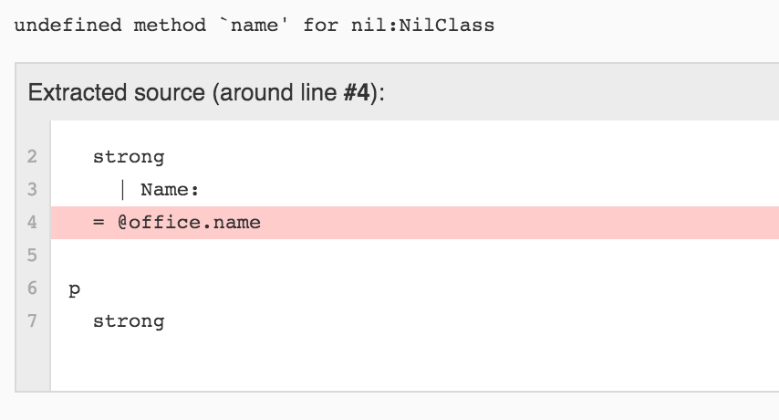
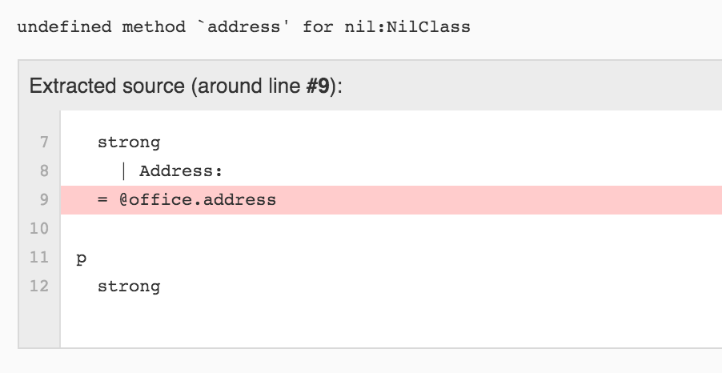
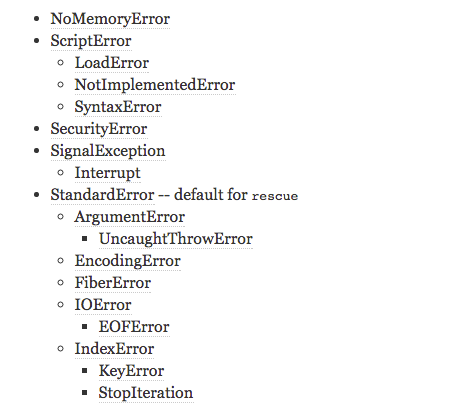

# Learning by Inspecting Troubled Code

By Dan Jakob Ofer (theScore)


Presented at Bitmaker Labs on Tuesday, October 6<sup>th</sup>, 2015

Slides uploaded at [www.danofer.com/presentations/bad_ruby](http://www.danofer.com/presentations/bad_ruby)

---

# Design Patterns

- Discuss six bad ideas
- Description of problem
- Solution with bad design pattern
- Alternatives with good design pattern

---

# One: Implement Methods on NilClass

- A @doctor `has_one` @office
- office might be nil

---

## Error: @office is Nil

- Imagine we have a @doctor that `has_one` @office
- @office is nil



---

## Bad Ruby

```ruby
class NilClass
  def name
    'Dr Crusher\'s Medical Office'
  end
end
```

---

# Two: Implement All Methods on NilClass

- Cannot access remaining methods on @office
- Too lazy to implement these remaining methods



---

## Bad Ruby

```ruby
class NilClass
  def method_missing(symbol, *args)
    "Sick Bay"
  end
end
```

---

## Good solution

1. Unstable state if @doctor does not have @office
2. **Nil Object** design pattern

```ruby
  class NilOffice
    def name
      'Empty Office'
    end

    def address
      'The City of Atlantis'
    end
  end
```

---

# Three: Guards Against nil

Reduce:

```ruby
if @doctor != nill
  && @doctor.office != nill
  && @doctor.office.admin && != nil
  && @doctor.office.admin == 'Wesley Crusher'

  @doctor.nepotistic? = :very_much_true
end
```

---

## To

```ruby
if @doctor.office.admin == 'Wesley Crusher'
  @doctor.nepotistic? = :very_much_true
end
```

---

## Bad Ruby

```ruby
class NilClass
  def method_missing(symbol, *args)
    nil
  end
end
```

---

## Good Solution

- [andand by Reg Braithwaite](https://github.com/raganwald/andand) (Old from 2013):

```ruby
  @doctor.andand.office.andand.admin == 'Wesley Crusher'
```

- `#try`, from [ActiveSupport](https://github.com/rails/rails/tree/master/activesupport) (Recent from Rails):

```ruby
  @doctor.try(:office).try(:admin) == 'Wesley Crusher'
```

---

## Continued

- **Law of Demeter** design pattern: Define method admin on `office_admin` on doctor

```ruby
class Doctor
  def office_admin
    office != nil && office.admin
  end
end
```

---

# Four: Symbols Use Memory

Convert user input into symbols

```ruby
symbols = []
while ((user_input = gets.strip) != 'exit') do
  symbols << user_input.to_sym
end
```

---

## Bad Ruby

Use Ruby version < 2.2.0

---

## Good Solution:

1. Never convert user input into symbols!
2. Use Ruby version >= 2.2.0


---

# Five: Reduce Non-StandardError Exceptions

```ruby
begin
  raise
rescue Exception => exc
  logger.log('I am logging all exceptions')
end
```

---

## Ruby Core

[Ruby Core Exceptions](http://ruby-doc.org/core-2.2.0/Exception.html)



---

## Good Solution


```ruby
begin
  raise
rescue StandardError => exc
  logger.log("Error:\n#{exc.message}\n#{exc.backtrace}")
end
```

```ruby
begin
  raise
rescue => exc
  logger.log("Error:\n#{exc.message}\n#{exc.backtrace}")
end
```

---

# Six: Exception Hiding

Hide an exception so that details of error do not bubble up to the user

---

## Bad Ruby

```ruby
begin
  begin
    raise 'Explanation of critical problem and how it occuered'
  rescue StandardError => exc
    # We hide the original message
    raise ''
  end
rescue StandardError => re_raised_exception
  # The message is blank :(
  puts re_raised_exception.message
end
```

---

## Good Solution

1. Exceptions help understand problem and why.
2. Exceptions allow developers to fix bugs.
3. Use [bugsnag](https://bugsnag.com/) to log exceptions
  - or just log to a plain file
4. In production mode:
  - Never display details of exception to user
  - E.g., [5xx](http://www.w3.org/Protocols/rfc2616/rfc2616-sec10.html) error page rather than detailed exception page

---

# Thank you!

Slides uploaded at [www.danofer.com/presentations/bad_ruby](http://www.danofer.com/presentations/bad_ruby)
