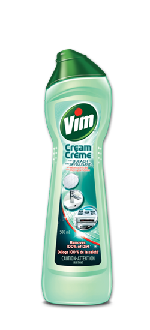
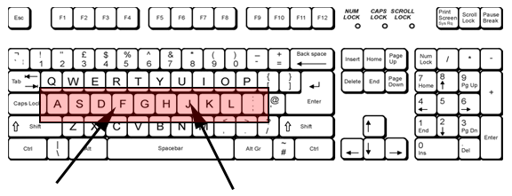
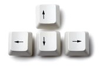
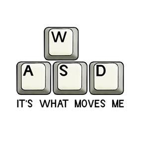
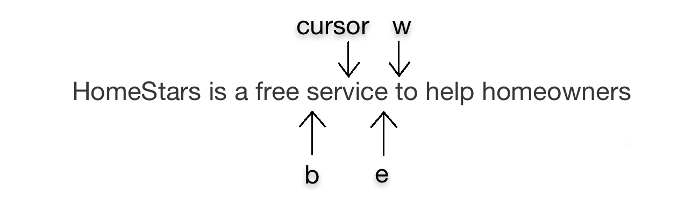
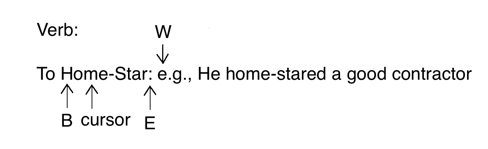
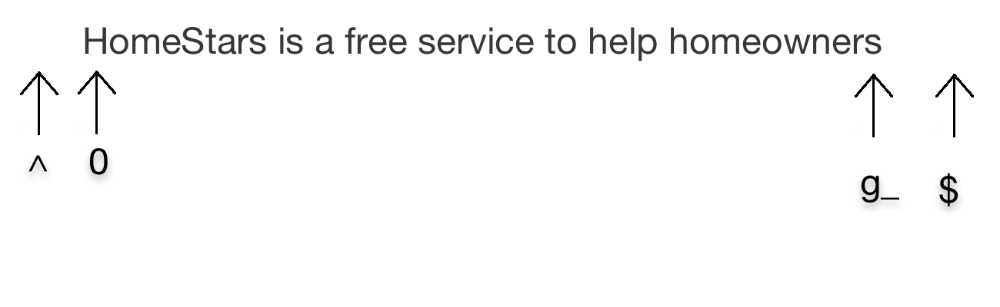
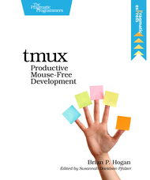

# How to be a HomeStar Runner with Vim
## A talk

By Dan Jakob Ofer (theScore)

Presented at HomeStars Toronto office on Thursday, April 30th, 2015
 
 

^ Where I come from, story of TextMate to Vim, Keyboard-centric experience

---

# Goal of Talk is to:

- Con**vi**nce you that typing is faster than mouse clicking

 **Why?** 

- Be a faster typist
- Ultimately be faster than your coworkers
- Wow your boss to make more money

^ Gateway drug to keyboard-centric computing, keyboard faster than mouse

---

# One Solution

A keyboard-centric text editor (Vim) Together with a robust terminal (iTerm 2) and a terminal multiplexer (tmux)

^ View of many programs in one window, including Git, Vim, log files

---

# What Can Vim Do For You?

- comprehensive navigation
- navigate by word
- effortless cleaning of computer case
- fast file switching
- language contextual features (formatting, text highlighting)
- remove spills off desk

---

# How to use Vim

Become acquainted with the home row

Ditch the  keys and the  pad

Learn 

^ Duality of movement keys and character keys

---

## Navigation (Normal Mode)

# word

word is a sequence of letters, digits, underscores, and other non-whitespace characters

---

# WORD

WORD is a sequence of non-whitespace characters

---

# More Navigation (Normal Mode)

---

# Redaction (Insert Mode)

- x (delete character under cursor)
- X (delete previous character)
- c (change character under cursor)
- C (change all characters to the right of cursor until new line)
- i (enter insert mode)
- I (enter insert mode from beginning of line)
- A (enter insert mode from last character)
- a (enter insert mode at next character under cursor)
- o (enter insert mode at previous line)
- O (enter insert mode at next line)

---

# Text Selection (Visual Mode)

- v (visual mode)
- V (visual-line mode)
- ^v (visual-block mode)

---

# Extensible File Editor

---

# Configuration

- Check out these [dotFiles](https://github.com/skwp/dotfiles) for sane configurations for your terminal, shell, Vim, and more
- Check out Kevin Jalbert's [gists](https://gist.github.com/kevinjalbert)

^ Mention that includes configuration of zsh and tmux, described next

---

# Shell

Use zsh, it is like Bash, but more programmable!
- Supports both Vim and emacs keybindings (faster navigation!)
- ^r to search command history
- Fuzzy pattern matching for commands
- Robust prompt, e.g., display Git repository status
- Many more

---

# tmux
## The Terminal Multiplexer

- Supports multiple panes and tabs
- Copy text across shells and text editors

Read this book [tmux: Productive Mouse-Free Development](https://pragprog.com/book/bhtmux/tmux)

---

# But Wait, There is More!

---

# For OS X

[LaunchBar](https://www.obdev.at/products/launchbar/index.html) (paid, but oh so worth it) from Objective Development

- Do almost anything from the keyboard
- Supports Vim-bindings!

---

# Vimium for both Chrome and Firefox

- Do almost anything from the keyboard
- Support for Vim-bindings

---

# Visual Studio (on Windows)

[ReSharper](https://www.jetbrains.com/resharper/) from JetBrains (paid and [open-source license](https://www.jetbrains.com/buy/opensource/?product=resharper) available)

- Supports keyboard shortcuts
- Provides superior code navigation
- Provides superior code refactoring

---

# Be More Productive with a Mechanical Keyboard

- With mechanical switches
- I recommend the [Das Keyboard](http://www.daskeyboard.com/) with [blue switches](http://www.daskeyboard.com/model-s-professional/)
- If it is too expensive then ask your employer to pay

---

# You can find these slides at [http://www.danofer.com/presentations/keyboard](http://www.danofer.com/presentations/keyboard)
